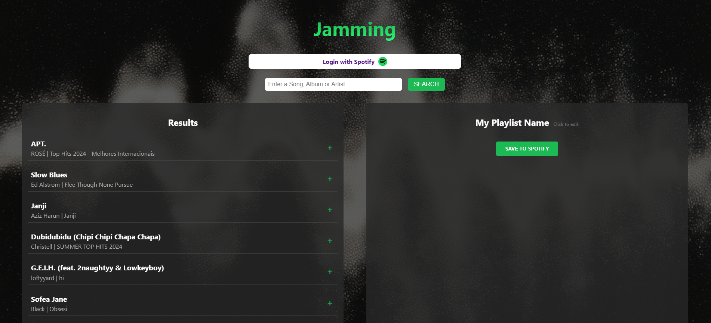
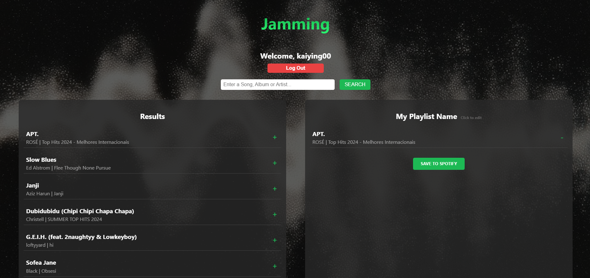
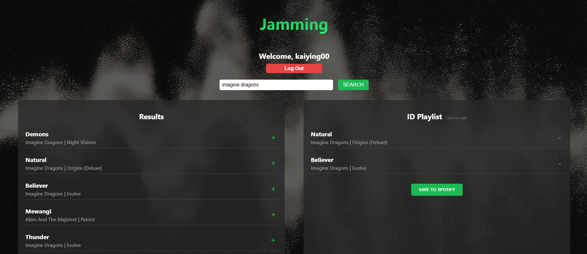

# Jammming🎵

Jammming is a React web application that allows users to search for songs using the Spotify API, create custom playlists, and save them directly to their Spotify account. This project is designed and implemented based on the Codecademy course.

## 🛠️ Tech Stack

HTML, CSS, ReactJS, Spotify API

## 🚀 Features

- 🔍 Search the Spotify music catalog by song title, artist, or album
- ➕ Add and remove tracks to a custom playlist
- 📝 Rename the playlist in real-time
- 💾 Save the playlist directly to your Spotify account

## 📌 Screenshots

## 📦 Setup

### Getting Started with Create React App

This project was bootstrapped with [Create React App](https://github.com/facebook/create-react-app).

### 1. Clone the repository

`git clone https://github.com/your-username/jammming.git`

`cd jammming`

### 2. Install dependencies

`npm install`

### 3. Add your credentials

In Spotify.js, replace:

`const clientId = 'YOUR_SPOTIFY_CLIENT_ID';`

`const redirectUri = 'http://localhost:3000/';`

### 4. In the project directory, you can run:

`npm start`

Runs the app in the development mode.\
Open [http://localhost:3000](http://localhost:3000) to view it in your browser.

The page will reload when you make changes.\
You may also see any lint errors in the console.

## 🧪 Learn More

You can learn more in the [Create React App documentation](https://facebook.github.io/create-react-app/docs/getting-started).
To learn React, check out the [React documentation](https://reactjs.org/).

## 🙌 Acknowledgement

This project is for educational and portfolio purposes only.

- Thanks to Spotify for the API.
- Inspired by the Codecademy React-Front End course project.
